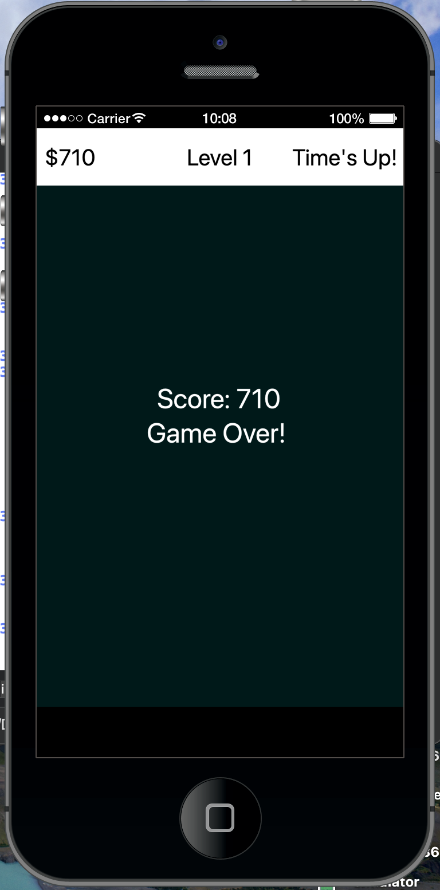

# Bucket Collector

Bucket Collector is a simple and fun game developed in Lua using the [Solar2D](https://solar2d.com/) game engine. The objective is to collect falling items using a bucket, testing your reflexes and coordination.

## Features

- Fast-paced, casual gameplay
- Simple controls
- Colorful graphics
- Easy to modify and extend

## Screenshots




## Getting Started

### Prerequisites

- [Solar2D](https://solar2d.com/) (formerly Corona SDK)

### Installation

1. **Download and install Solar2D**  
   Visit the [Solar2D Download Page](https://solar2d.com/downloads/) and follow the instructions for your operating system.

2. **Clone or download this repository**

   ```
   git clone <repository-url>
   ```

3. **Open the project in Solar2D Simulator**

   - Launch Solar2D Simulator.
   - Select `File > Open...` and navigate to the project folder.

4. **Run the game**
   - Press the play button in the simulator to start playing.

## How to Play

- Move the bucket left or right to catch falling items.
- Avoid missing items to keep your score up.
- Try to beat your high score!

## Contributing

Contributions are welcome! Feel free to fork the repository and submit pull requests.

## License

This project is open source and available under the MIT License.
